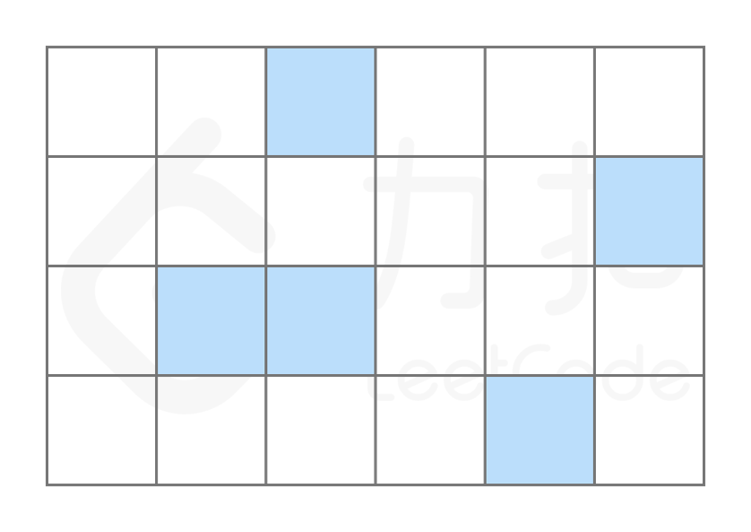
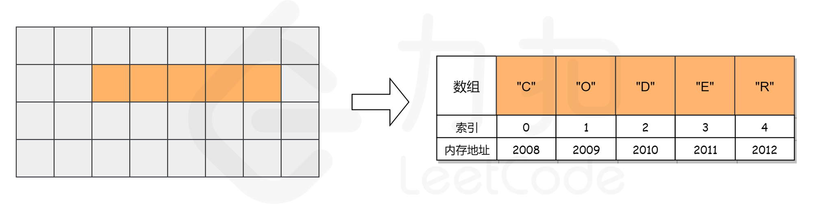
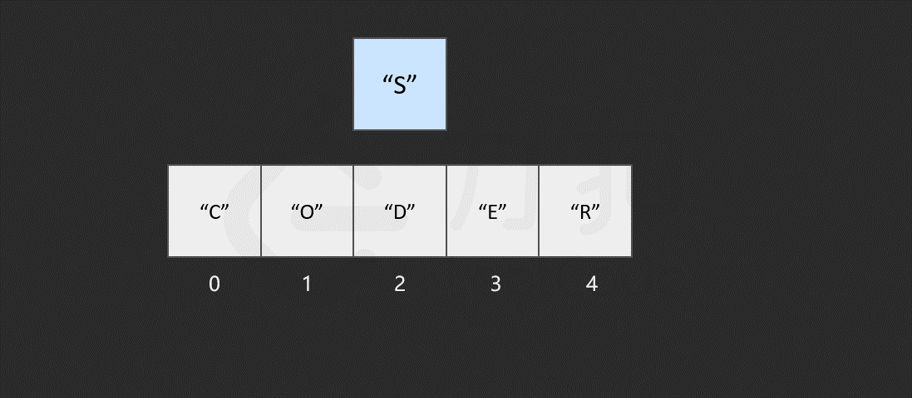
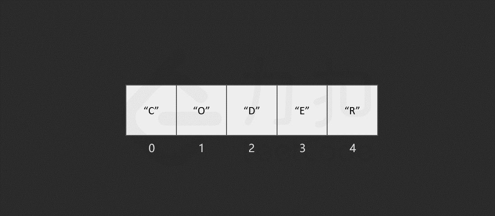

## 数组

::: tip  概述

`数组` 是数据结构中的基本模块之一。因为 `字符串` 是由字符数组形成的，所以二者是相似的。大多数面试问题都属于这个范畴。

:::

### 集合

---

> **定义**
>
> 由一个或多个确定的元素所构成的整体
>
> **特性**
>
> * **集合里的元素类型不一定相同**
> * **集合里的元素没有顺序**

### 列表

---

> **定义**
>
> 是一种数据项构成的有限序列，即按照一定的线性顺序，排列而成的数据项的集合,最常见的表现形式有数组和链表
>
> **特性**
>
> * **具有顺序**
> * **长度是可变**

### 数组

---

::: tip 定义

数组是列表的实现方式

:::

**特性**

* **具有顺序**
* **长度是可变**
* **索引**

数组会用一些名为 `索引` 的数字来标识每项数据在数组中的位置，且在大多数编程语言中，索引是从 `0` 算起的。我们可以根据数组中的索引，快速访问数组中的元素

而列表中没有索引，这是数组与列表最大的不同点。

其次，数组中的元素在内存中是连续存储的，且每个元素占用相同大小的内存。要理解这一点，我们需要了解数组在内存中的存储方式，我们将在下一节中详细介绍。

相反，列表中的元素在内存中可能彼此相邻，也可能不相邻。比如列表的另一种实现方式——链表，它的元素在内存中则不一定是连续的

### 数组的操作

#### 读取元素

---

读取数组中的元素，是通过访问索引的方式来读取的，索引一般从 0 开始。

在计算机中，内存可以看成一些已经排列好的格子，每个格子对应一个内存地址。一般情况下，数据会分散地存储在不同的格子中。

而对于数组，计算机会在内存中为其申请一段 连续 的空间，并且会记下索引为 0 处的内存地址。以数组 ["C", "O", "D", "E", "R"] 为例，它的各元素对应的索引及内存地址如下图所示。

假如我们想要访问索引为 2 处的元素 "D" 时，计算机会进行以下计算：

找到该数组的索引 0 的内存地址： 2008；
将内存地址加上索引值，作为目标元素的地址，即 2008 + 2 = 2010，对应的元素为 "D"，这时便找到了目标元素。
我们知道，计算内存地址这个过程是很快的，而我们一旦知道了内存地址就可以立即访问到该元素，因此它的时间复杂度是常数级别，为 O(1)。

#### 查找元素

---

假如我们对数组中包含哪些元素并不了解，只是想知道其中是否含有元素 "E"，数组会如何查找元素 `"E" 呢？

与读取元素类似，由于我们只保存了索引为 0 处的内存地址，因此在查找元素时，只需从数组开头逐步向后查找就可以了。如果数组中的某个元素为目标元素，则停止查找；否则继续搜索直到到达数组的末尾。

我们发现，最坏情况下，搜索的元素为 "R"，或者数组中不包含目标元素时，我们需要查找 n 次，n 为数组的长度，因此查找元素的时间复杂度为 O(N)O(N)O(N)，NNN。

#### 插入元素

---

假如我们想在原有的数组中再插入一个元素 "S" 呢？

如果要将该元素插入到数组的末尾，只需要一步。即计算机通过数组的长度和位置计算出即将插入元素的内存地址，然后将该元素插入到指定位置即可。

然而，如果要将该元素插入到数组中的其他位置，则会有所区别，这时我们首先需要为该元素所要插入的位置 腾出 空间，然后进行插入操作。比如，我们想要在索引 2 处插入 "S"。

我们发现，如果需要频繁地对数组元素进行插入操作，会造成时间的浪费。事实上，另一种数据结构，即链表可以有效解决这个问题，我们将在另外的卡片中进行学习。

#### 删除元素

---

删除元素与插入元素的操作类似，当我们删除掉数组中的某个元素后，数组中会留下 空缺 的位置，而数组中的元素在内存中是连续的，这就使得后面的元素需对该位置进行 填补 操作。

以删除索引 1 中的元素 "O" 为例，具体过程如图所示。

当数组的长度为 n 时，最坏情况下，我们删除第一个元素，共需要的步骤数为 1 + (n - 1) = n 步，其中，1 为删除操作，n - 1 为移动其余元素的步骤数。删除操作具有线性时间复杂度，即时间复杂度为 O(N)O(N)O(N)，NNN 为数组的长度。
